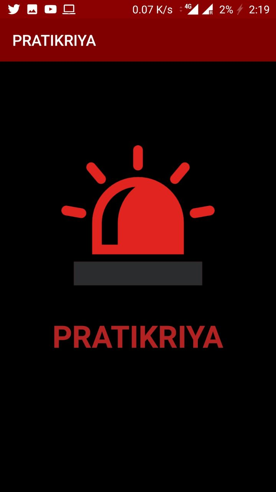
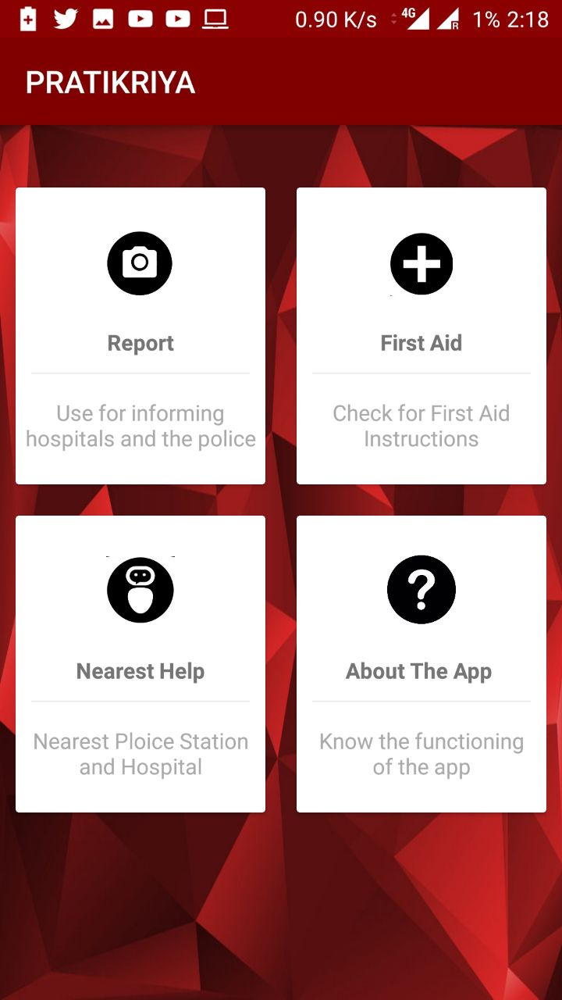
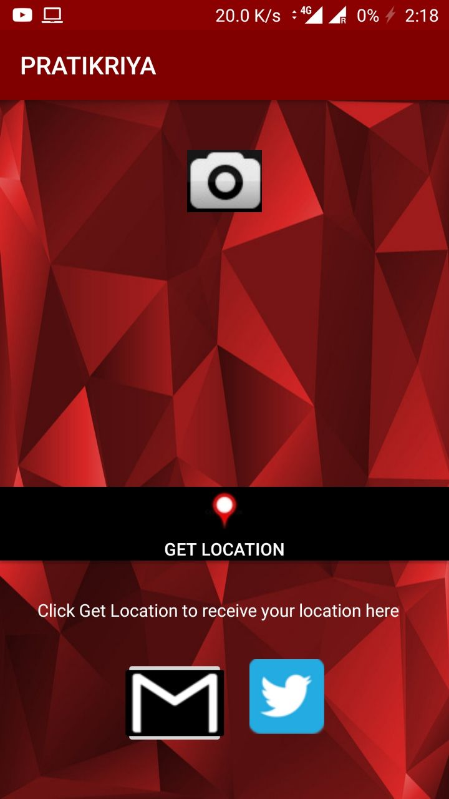
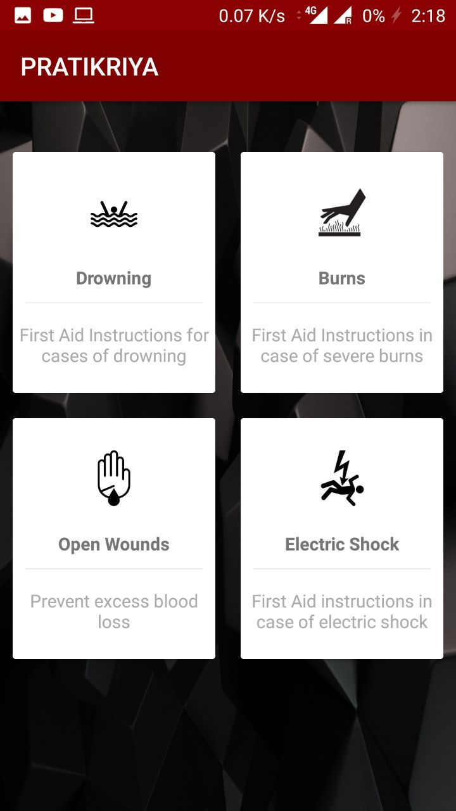
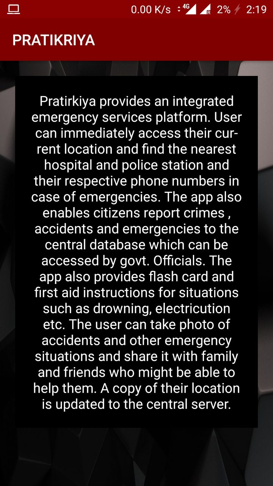

#                                                       Pratikriya

### Pratirkiya provides an integrated emergency services platform. 

User can immediately access their current location and find the nearest hospital& police station and their respective phone numbers in case of emergencies.
The app also enables citizens report crimes , accidents and emergencies to the central database which can be accessed by govt. Officials.
Flash card and First Aid instructions for situations such as drowning, electrocution etc are alos provided in the app.

The user can take photo of accidents and other emergency situations and share it with family and friends who might be able to help them. A copy of their location is updated to the central server. Sharing a pic along with the location of the user also helps filter out fake calls to the police and hospital since our app will not accept submission until and unless both the image and location has been selected.

 	The app also returns the distance of the nearest Police station and Hospital and also reports
            the time required by police and ambulance to reach the accident side .     

All the police stations will also have a Receiver App which will send notifications to their phone whenever a crime is reported using this app .

In India, where there is currently a very unorganised and distributed emergency services system , with different states having different helplines for medical criminal or arson emergencies, an application which integrates all of them together under one quick, responsive and easy to use app is the need of the hour.

(Many cities have 100 facility but most of them have very poor response time and sometimes no respone at all.)

Having an integrated app ensures that their concerns are addressed to the authorities.

Please note that you will find two source codes one for Pratikriya and one for Pratikriya Receiver.Both of these are separate apps , one for sending the information regrading an accident ie Pratikriya and the other (Pratikriya Receiver) will be for receiving the notification regarding any accident along with the location ( as mentioned this app will be given to police and hospitals).
3 links in total -
* https://github.com/dhruvrnaik/script_apicall
* https://github.com/shouryaj98/PratikriyaReceive
* https://github.com/dhruvrnaik/Pratikriya

## [Demo Video](https://youtu.be/IM1gyETXnrA )

Project by
* Anisha Pal
* Shourya Jaiswal
* Dhruv Naik

## UI

